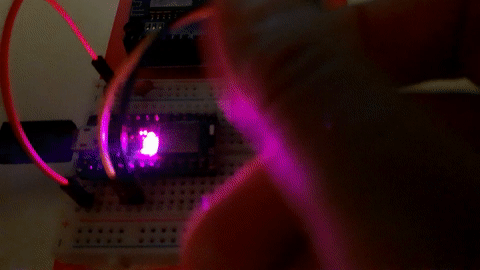

### APA102 & QUADRATIC ENCODER EXAMPLE

Made for Adafruit ItsyBitsy nRF52840 Express board (https://learn.adafruit.com/adafruit-itsybitsy-nrf52840-express)



__NOTE__: In order to use the qed module, it's necessary at the moment (November 8, 2020) to use v0.11.1 of the nrf-hal-common, from this repo:

https://github.com/nrf-rs/nrf-hal

There is a problem, though: there seems to be a version conflict between the dependencies, so in order to make it work I made a custom local fork of the HAL crate,
downgrading the nb dependency to from 1.0.0 to 0.1.2 (compatible with the one used in embedded-hal). In order to use this code one must edit the `Cargo.toml` accordingly.

### HOW TO FLASH:

* build the code: ```cargo build --release```
* convert to .hex file: ```arm-none-eabi-objcopy -O ihex target/thumbv7em-none-eabihf/release/blinky_neopixel neopixel.hex```
* create a dfu package: ```adafruit-nrfutil dfu genpkg --dev-type 0x0052 --application neopixel.hex neopixel.zip```
* put the board into bootloader mode (double click on reset button, will show up as _ITSY840BOOT_ or similar)
* flash the firmware: ```adafruit-nrfutil dfu serial --package neopixel.zip -p /dev/ttyACM0 -b 115200```
